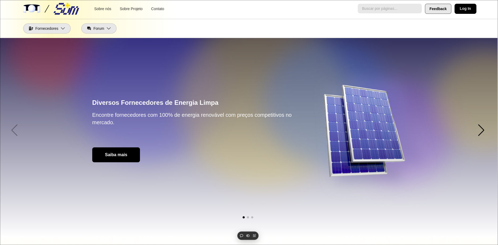

# Projeto Global Solution 2 Semestre - Front end Design Engineer

O Global Solution – 2º Semestre de 2024 convida os
estudantes a se tornarem protagonistas dessa
transformação. Em parceria com líderes do setor, o
desafio deste semestre tem como tema central a Energia
para um Futuro Sustentável.

O objetivo é engajar mentes criativas e inovadoras na construção de soluções que possam
impactar positivamente o futuro da energia no Brasil e no mundo.

O evento desafia os participantes a pensarem em
soluções tecnológicas e modelos de negócios que
não apenas enfrentem os problemas energéticos
atuais, mas também promovam justiça social,
crescimento econômico sustentável e
preservação ambiental.


## Autores

- [Daniel Saburo Akiyama](https://www.github.com/danielthx23) RM 558263
- [João Pedro] RM
- [Danilo Correia] RM


## Solução Proposta

### SUM +


Uma plataforma de venda e compra de energia que deseja engajar o usuário com sua comunidade.

O projeto deseja criar uma comunidade de fornecedores e consumidores de energia limpa, não apenas habilitando a venda e compra de energia limpa, mas também promovendo a colaboração entre pessoas para se converterem à energia limpa, com fóruns de ajuda e posts.


## Layout e Páginas Principais





## Installation

Install my-project with npm

```bash
  npm install my-project
  cd my-project
```
    
## Deployement Front
## Deployement Back
