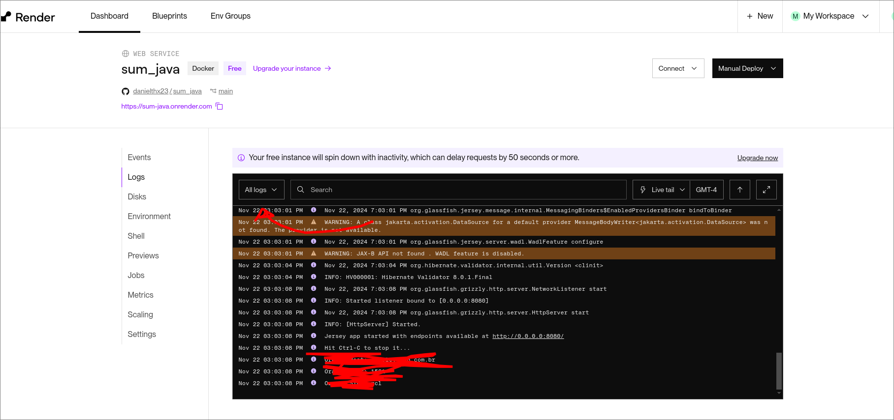

# Projeto Global Solution 2 Semestre - Front end Design Engineer

O Global Solution – 2º Semestre de 2024 convida os
estudantes a se tornarem protagonistas dessa
transformação. Em parceria com líderes do setor, o
desafio deste semestre tem como tema central a Energia
para um Futuro Sustentável.

O objetivo é engajar mentes criativas e inovadoras na construção de soluções que possam
impactar positivamente o futuro da energia no Brasil e no mundo.

O evento desafia os participantes a pensarem em
soluções tecnológicas e modelos de negócios que
não apenas enfrentem os problemas energéticos
atuais, mas também promovam justiça social,
crescimento econômico sustentável e
preservação ambiental.


## Autores

- [Daniel Saburo Akiyama](https://www.github.com/danielthx23) RM 558263
- [João Pedro] RM
- [Danilo Correia] RM


## Solução Proposta

### SUM +


Uma plataforma de venda e compra de energia que deseja engajar o usuário com sua comunidade.

O projeto deseja criar uma comunidade de fornecedores e consumidores de energia limpa, não apenas habilitando a venda e compra de energia limpa, mas também promovendo a colaboração entre pessoas para se converterem à energia limpa, com fóruns de ajuda e posts.


## Layout e Páginas Principais


Botão no canto direito superior que abre um modal de buscar páginas.

Tela home contem um carousel, dois swipers e um container de oferta.


Página de cadastros contem 4 steps


Tela de login recebe cpf ou cnpj e a senha.


Tela de contato, ela e o feedback são identicas


Footer da página


Tela de fornecimentos, cards e é possivel alterar e deletar. As telas de alterar e deletar são outras páginas mas são complementares.


Tela de posts, cards e é possivel alterar e deletar. As telas de alterar e deletar são outras páginas mas são complementares.
Também mostra os comentarios dentro de detalhes, nessa tela de detalhe tem o forms de comentarios e os comentários.


Páginas de Sobre


## Instalação Rodar Local

Instale o projeto com npm

```bash
  git clone <link do git do projeto>
  cd <path do projeto>
  npm install
```
Antes de rodar o npm install crie um arquivo .env e adicione a variavel de ambiente contido no .txt dentro do zip da entrega

Depois disso rode npm run dev

```bash
  npm run dev
```

## Deploy na Vercel

https://sum-global.vercel.app/

Link do Deploy

## Deploy no Render

Utilize as credenciais contidas no .txt para entrar no Render

Acesse os Dashboards e acesse o Deploy


Se você quiser acessar as variaveis de ambiente acesse essa aba


Caso você queira acessar os logs da aplicação Java Dockerizada acesse aqui, caso o deploy devolva status code 500 você pode ler qual erro deu por aqui.



## Link do Video da Explicação

Youtube

https://youtu.be/MZl5ffMgnWs


## Considerações
- O Render depois de um tempo hiberna, então caso alguma requisição não funcione tente fazer a requisição denovo
- O contato e feedback não envia um e-mail

## Melhorias
- Melhorar o layout
- Arrumar os erros do toastalerta, que não fazem sentido algumas vezes
- Telas de sobre estão bagunçadas
- Adicionar VIACEP no formulário
